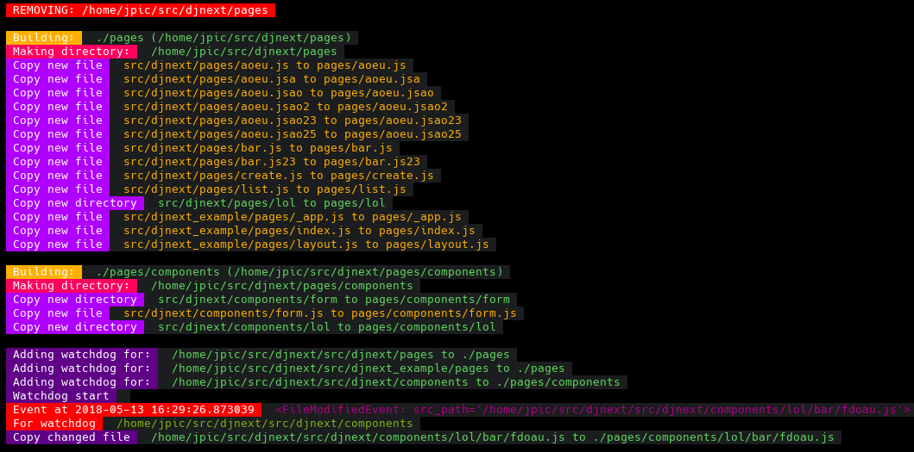

Monitor sub directories of INSTALLED_APPS: django-appwatch
~~~~~~~~~~~~~~~~~~~~~~~~~~~~~~~~~~~~~~~~~~~~~~~~~~~~~~~~~~

Suppose you want to build a js directory from the js directory in all
INSTALLED_APPS::

    manage.py appwatch js:./js

Or, for NextJS support::

    manage.py appwatch pages:./pages

Or, for NextJS support and also have a components sub dir::

    manage.py appwatch pages:./pages components:./pages/components

Install with:

- ``pip install django-appwatch``
- Add ``appwatch`` to ``INSTALLED_APPS``

Have fun provisionning other frameworks with Django :)

